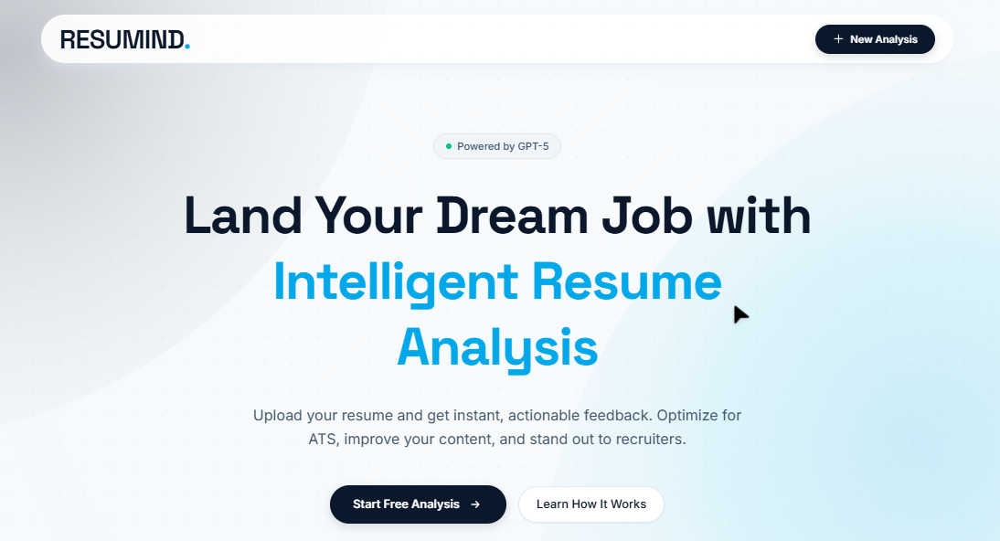
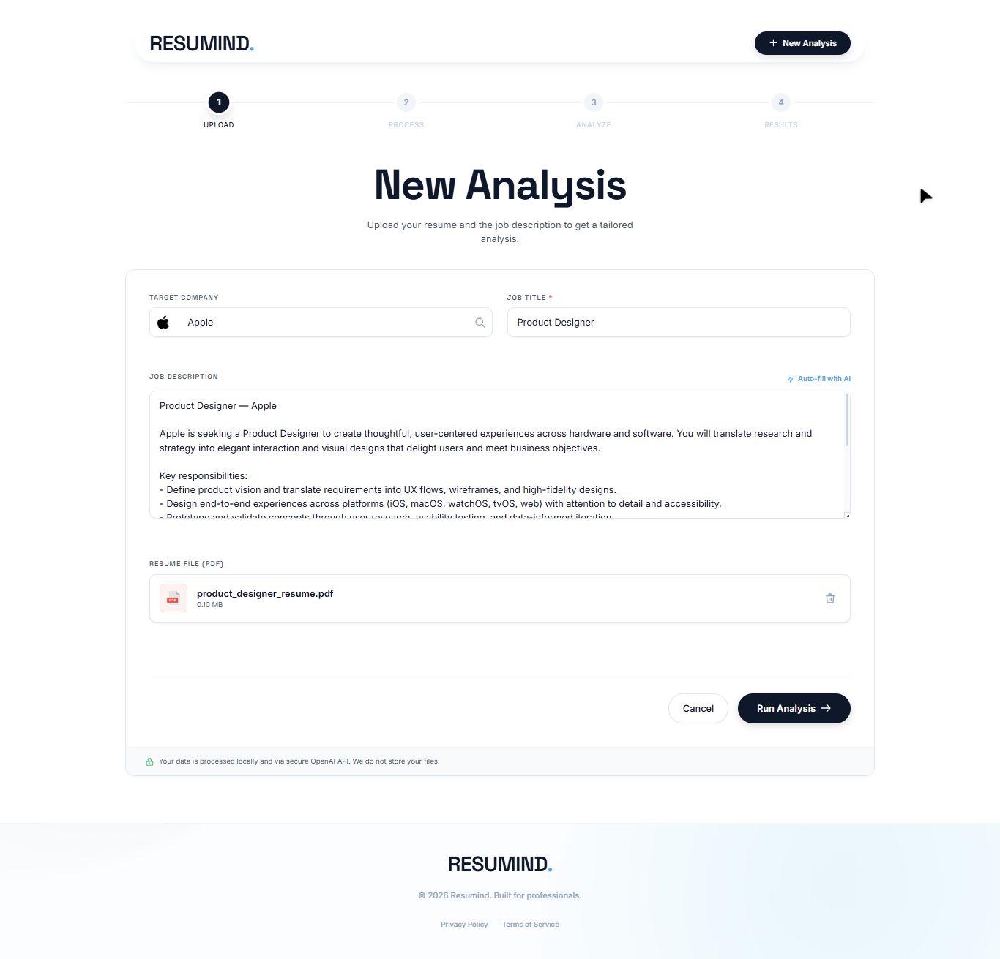
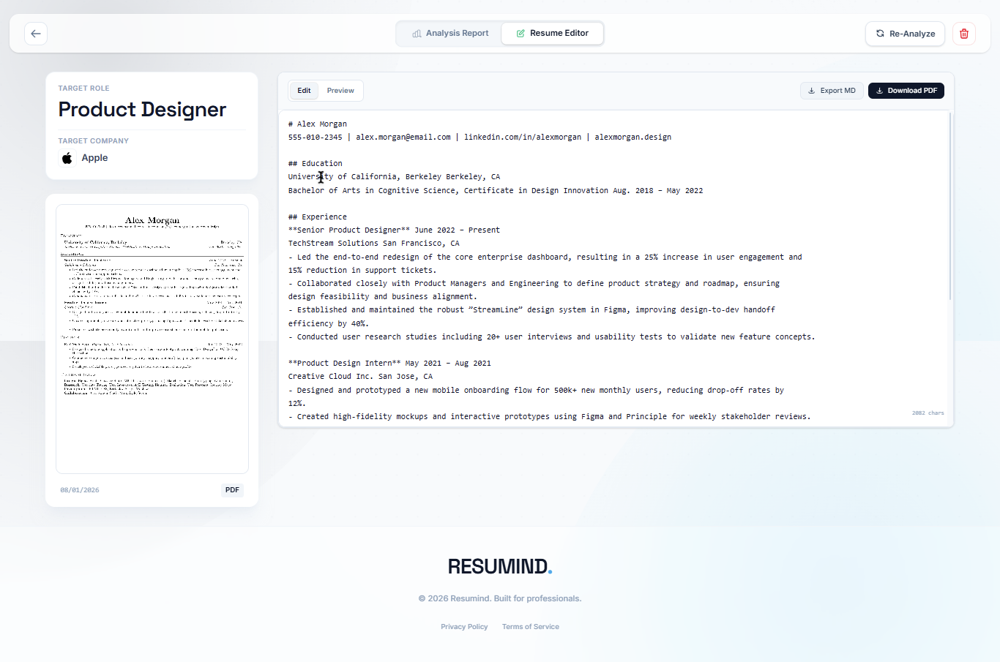
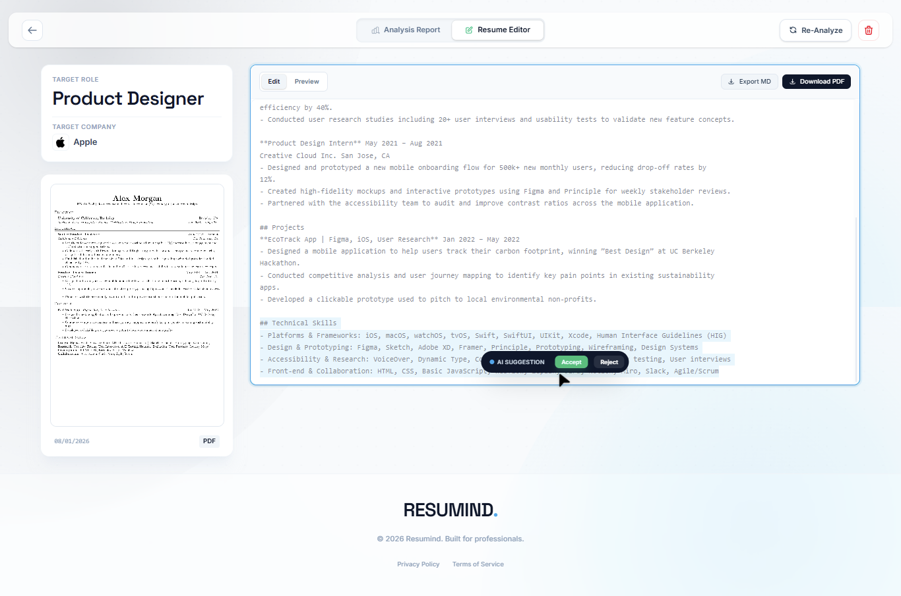
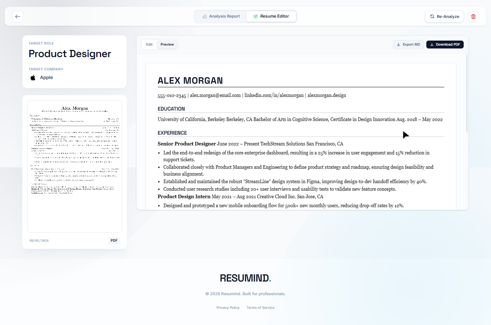
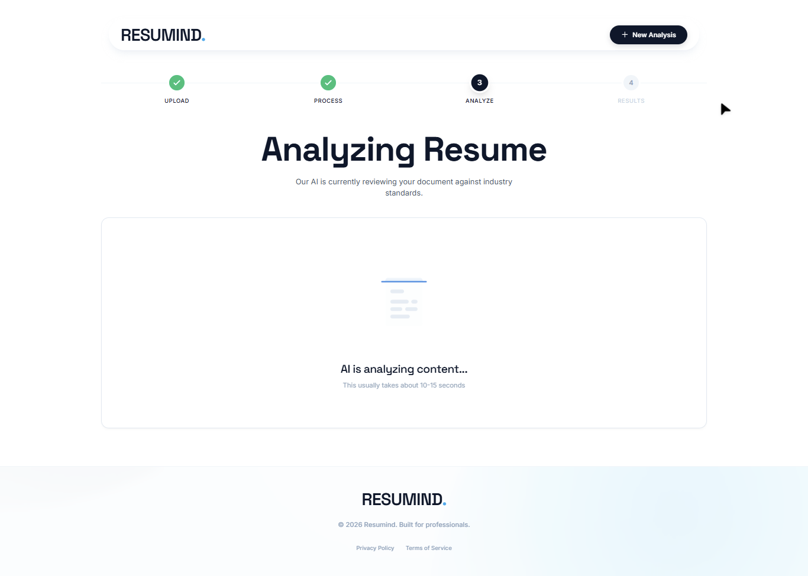

# RESUMIND - AI Resume Analyzer Agent

**Resumind** is an intelligent, privacy-first resume analysis platform built with Next.js 16. It leverages AI (OpenAI GPT-5 mini) to critique resumes, scoring them against ATS (Applicant Tracking System) standards, and offers instant, one-click fixes.

## 📸 Preview



| Upload & Analyze | Resume Score |
|------------------|--------------|
|  |  |

| Resume Editor | AI Fix Popup |
|---------------|--------------|
|  |  |

| Editor Preview | Analyzing |
|----------------|-----------|
|  |  |


## 🚀 Key Features

### 1. 🧠 AI Resume Analysis
*   **Deep Scoring**: Analyzes resumes across 5 dimensions: ATS Compatibility, Content Quality, Structure, Tone, and Skills.
*   **Instant Feedback**: Provides specific, actionable advice for every section.
*   **Privacy First**: No data storage. All analysis happens in-session; resumes are processed and then discarded.

### 2. 📝 Advanced Resume Reconstruction & Editor
*   **Total Reconstruction**: Upload any PDF (even image-based or LaTeX), and the AI reconstructs it into clean, editable Markdown.
*   **Dual-Mode Editor**:
    *   **Edit Mode**: Distraction-free Markdown editing.
    *   **Preview Mode**: Visual, paper-like preview that supports rich HTML badges and standard Serif typography.
*   **Smart Fixes**: Apply AI-suggested content improvements with a single click.

### 3. 🎨 Premium UI/UX
*   **Glassmorphism Design**: Clean, modern interface with translucent headers and smooth animations.
*   **Live PDF Preview**: Your original PDF stays visible in the sidebar for easy reference.
*   **Interactive Dashboard**: Visual score rings and accordions for easy data consumption.

## 🛠️ Tech Stack

*   **Framework**: Next.js 16 (App Router)
*   **Language**: TypeScript
*   **Styling**: Tailwind CSS v4, Vanilla CSS (for print)
*   **Icons**: [Gilbarbara Logos](https://github.com/gilbarbara/logos) (3000+ brands)
*   **AI**: OpenAI API (GPT-5 mini)
*   **PDF Processing**: `pdfjs-dist`
*   **Storage**: IndexedDB (via Dexie) for local history
*   **Markdown**: `react-markdown` + `rehype-raw` (SVG/HTML support)

## 🏃‍♂️ Getting Started

1.  **Clone the repository**:
    ```bash
    git clone https://github.com/saifyxpro/resumind-ai.git
    cd resumind-ai
    ```

2.  **Install dependencies**:
    ```bash
    npm install
    ```

3.  **Set up Environment**:
    Create a `.env.local` file in the root:
    ```env
    NEXT_PUBLIC_OPENAI_API_KEY=sk-your-api-key
    ```

4.  **Run Development Server**:
    ```bash
    npm run dev
    ```

    Open [http://localhost:3000](http://localhost:3000) to start analyzing.

## 🤝 Contributing

Contributions are what make the open source community such an amazing place to learn, inspire, and create. Any contributions you make are **greatly appreciated**.

See [CONTRIBUTING.md](./CONTRIBUTING.md) for detailed guidelines.

## 📄 License
© 2026 Resumind. Built for professionals.
